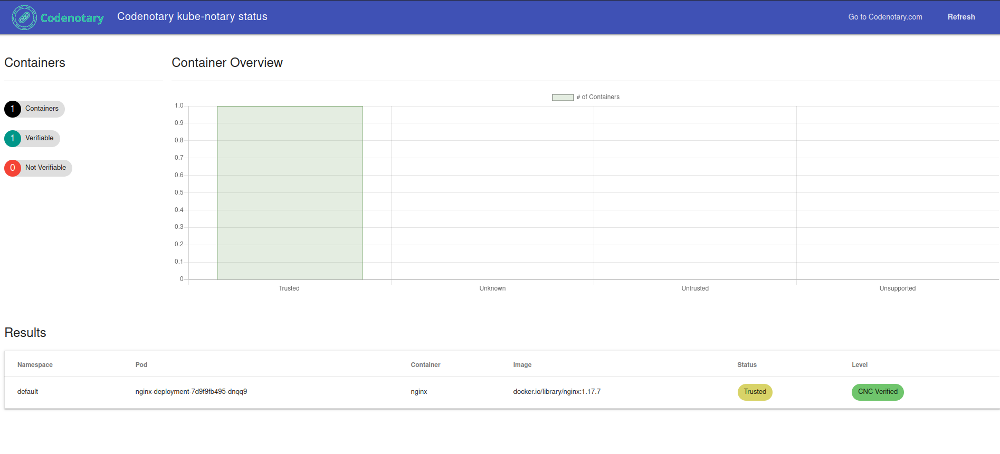

## Demo

### Running kube-notary on a local cluster 
We are gonna use a kind local cluster, to do so first we need to add a basic cluster config:
```
╰─ cat kind-example-config.yaml  
# three node (two workers) cluster config
kind: Cluster
apiVersion: kind.x-k8s.io/v1alpha4
nodes:
- role: control-plane
- role: worker
- role: worker
```
then invoke cluster creation
```
kind create cluster --config kind-example-config.yaml --name kluster
```

Once the cluster is Up and running we will deploy the Kubernetes watcher on it.
First step is to create a Ledger, SignerID and Api Key from codenotary cloud, once done, attach api key to a secret:

```
kubectl create secret generic vcn-lc-api-key --from-literal=api-key=FooSignerID.NWxcWDUOcMXfjtsDYKgMrEvGSnccbtsRVwaS
```
Apply all required manifests:
```
kubectl apply -f kubernetes/kube-notary/templates/configmap.yaml  
kubectl apply -f kubernetes/kube-notary/templates/serviceaccount.yaml
kubectl apply -f kubernetes/kube-notary/templates/role.yaml
kubectl apply -f kubernetes/kube-notary/templates/rolebinding.yaml
kubectl apply -f kubernetes/kube-notary/templates/deployment.yaml
kubectl apply -f kubernetes/kube-notary/templates/service.yaml
```

Check kube-notary pod status and name:
```
kubectl get pods |grep kube-notary                          
kube-notary-7b5c5d57c5-6jldr        1/1     Running   0          5m32s
```

Watch kube-notary watcher logs:
```
kubectl logs kube-notary-7b5c5d57c5-6jldr -f
```

Apply nginx deployment:
```
kubectl apply -f demo/nginx-deployment.yaml
```

Kube-Notary watcher will find this image and it will detect it as a not notarized one:
```
DEBU[0057] Veryfy image name docker.io/library/nginx:1.17.7 id docker.io/library/nginx@sha256:8aa7f6a9585d908a63e5e418dc5d14ae7467d2e36e1ab4f0d8f9d059a3d071ce hash sha256:c7460dfcab502275e9c842588df406444069c00a48d9a995619c243079a4c2f7 
WARN[0057] Image docker.io/library/nginx@sha256:8aa7f6a9585d908a63e5e418dc5d14ae7467d2e36e1ab4f0d8f9d059a3d071ce in pod nginx-deployment-7d9f9fb495-dnqq9 not found: artifact is not found 
```

Notarize this image
```
vcn n --bom --lc-host localhost --lc-port 3324 --lc-no-tls --lc-api-key=FooSignerID.NWxcWDUOcMXfjtsDYKgMrEvGSnccbtsRVwaS image://docker.io/library/nginx:1.17.7
```

Once notarization has been complete, at the next pull iteration it will detect the image as Trusted:

```
DEBU[0153] Veryfy image name docker.io/library/nginx:1.17.7 id docker.io/library/nginx@sha256:8aa7f6a9585d908a63e5e418dc5d14ae7467d2e36e1ab4f0d8f9d059a3d071ce hash sha256:c7460dfcab502275e9c842588df406444069c00a48d9a995619c243079a4c2f7 
INFO[0153] Image is trusted  container=nginx container_id="containerd://395220753b4190cf3192b9fd3911272e68b585207453a7428e307c7d9af4149a" hash=c7460dfcab502275e9c842588df406444069c00a48d9a995619c243079a4c2f7 image="docker.io/library/nginx:1.17.7" image_id="docker.io/library/nginx@sha256:8aa7f6a9585d908a63e5e418dc5d14ae7467d2e36e1ab4f0d8f9d059a3d071ce" namespace=default pod=nginx-deployment-7d9f9fb495-dnqq9 trusted=false verification_date= verification_level="0 - UNKNOWN" verification_status=TRUSTED
```

You can check the global status using the kube-notary http server, to do so just port forward it. Use previous kube-notary pod name to do so:

```
kubectl port-forward pod/kube-notary-7b5c5d57c5-6jldr 9581:9581 
```
Open the browser on http://localhost:9581/status/



You can get raw data from the results endpoint too, open http://localhost:9581/results.
```json
[{
	"hash": "c7460dfcab502275e9c842588df406444069c00a48d9a995619c243079a4c2f7",
	"containers": [{
		"namespace": "default",
		"pod": "nginx-deployment-7d9f9fb495-dnqq9",
		"container": "nginx",
		"containerID": "containerd://395220753b4190cf3192b9fd3911272e68b585207453a7428e307c7d9af4149a",
		"image": "docker.io/library/nginx:1.17.7",
		"imageID": "docker.io/library/nginx@sha256:8aa7f6a9585d908a63e5e418dc5d14ae7467d2e36e1ab4f0d8f9d059a3d071ce"
	}],
	"verification": {
		"level": 98,
		"status": 0,
		"timestamp": "2022-10-14T10:23:02Z",
		"trusted": true
	}
}]
```